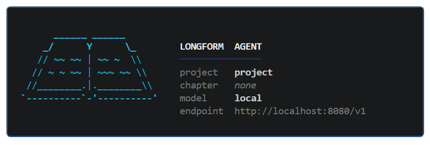

# Longform Agent

A minimal harness for collaborating with an LLM on long-form writing projects.
Built out of practical necessity, not as a framework.



---

## Why this exists

This started as a personal tool for working on a manuscript that had grown to
roughly 350 pages. At that scale, standard AI chat interfaces become awkward
fast: every turn re-processes the full conversation, cloud credit limits
interrupt flow at the worst moments, and the model has no memory of decisions
made three sessions ago.

Purpose-built writing tools exist — some are genuinely impressive, with their
own fine-tuned models and fast long-context inference — but they tend to
chunk documents for processing, which causes content to bleed across chapters
and repeat. The tool owns the structure; the author is a passenger.

The actual engineering problem underneath all of this is smaller than it looks
once you name it clearly:

1. **Prefill cost.** In cloud APIs, tokens already in the KV cache cost a
   fraction of fresh tokens. A system prompt that stays stable across turns —
   instructions, project bible, completed-chapter summaries — pays for itself
   quickly at the scale of a book. Locally, cache reuse means faster responses.

2. **Input tokens per turn.** A 350-page manuscript cannot fit in a context
   window. You need a principled strategy for what the model sees each turn:
   the active chapter in full, compressed summaries of completed chapters, a
   rolling conversation summary, and a bounded verbatim history window. Each
   layer has a different half-life; they should be managed separately.

3. **Output tokens per turn.** Keeping responses focused — proposing targeted
   unified diffs rather than rewriting whole sections — makes each turn
   cheaper, faster, and easier to review. The model should edit, not recite.

4. **Conversational continuity and tools.** Within those constraints, the model
   should be able to search for facts, edit files, and remember decisions
   across sessions — without the author losing sight of what changed and why.

This harness is a working answer to those four constraints. It is not
production software. It is a tool that keeps its own mechanics visible so that
you can understand, modify, and extend it for your own situation.

---

## Key features

- **Stable system prompt prefix** -- instructions, project bible, and chapter
  summaries are assembled once per turn into a prefix that rarely changes,
  maximising KV-cache reuse whether you are on a local server or paying per
  token in the cloud.
- **Layered dynamic context** -- the active chapter, agent memory, rolling
  conversation summary, and last N verbatim turns are injected separately, each
  managed with its own size cap and eviction policy.
- **Sliding conversation window** -- turns that fall outside the verbatim
  window are folded into a rolling summary by a second, independent LLM call,
  so the model always has a compressed record of prior sessions.
- **Diff-based editing** -- the model proposes changes as unified diffs; the
  author reviews and accepts or rejects each one. No silent rewrites.
- **Working memory** -- the agent maintains a persistent `agent_memory.md`
  file for facts and decisions that need to survive across sessions.
- **Tool registry** -- tools are plain OpenAI function-calling schemas.
  Adding one means two edits: a schema entry in `llm.py` and a handler in
  `agent.py`. No base classes, no decorators.
- **Provider-agnostic** -- the OpenAI client talks to llama.cpp, Ollama, LM
  Studio, or the real OpenAI API without code changes.

---

## Architecture overview

```
src/longform_agent/
  cli.py          Entry point, REPL, slash commands
  agent.py        Agent turn loop, tool dispatch
  context.py      Context assembly (system prompt + per-turn messages)
  tools.py        WebSearch, PatchEditor, ShellRunner
  llm.py          LLMClient, tool schema registry, system prompt base
  summarizer.py   Rolling conversation summary, chapter summariser
  config.py       Configuration dataclasses, TOML loader
```

**Data flow for one turn:**

```
User input
  -> ContextManager.build_system_prompt()   # stable prefix (bible, summaries)
  -> ContextManager.build_messages()        # dynamic context + user message
  -> LLMClient.chat()                       # initial model call
  -> tool loop:
       model returns tool_calls
       -> _execute_tool() dispatches + gets result
       -> result injected as 'tool' role message
       -> LLMClient.chat() again
       (repeat until stop or iteration cap)
  -> final text returned to REPL
  -> history saved, summary updated if window full
```

---

## Context assembly and KV-cache design

Every turn constructs context from two independent layers. The split is
intentional: the stable layer rarely changes between turns, so the model
server — local or cloud — can keep it in cache and skip re-processing it.
The dynamic layer changes on every turn and is built fresh each time.

```
STABLE PREFIX  (system prompt — cached by the server)
┌──────────────────────────────────────────────────────────────────┐
│  Base instructions    tone, tool rules, workflow guidance        │
│  <project_bible>      characters, world-rules, continuity notes  │
│  <chapter_summaries>  one prose summary per completed chapter    │
│  <chapters_full_text> last N completed chapters verbatim ──────┐ │
└────────────────────────────────────────────────────────────────┼─┘
              max_full_chapters ─────────────────────────────────┘
              stable across turns → cache stays warm

DYNAMIC SECTION  (messages array — rebuilt every turn)
┌──────────────────────────────────────────────────────────────────┐
│  <active_chapter>        full text of the chapter you are on     │
│  <agent_memory>          persistent decisions and working facts  │
│  <conversation_summary>  rolling prose of evicted turns          │
│  <recent_conversation>   last N verbatim exchanges ────────────┐ │
│  user message                                                  │ │
└────────────────────────────────────────────────────────────────┼─┘
              keep_last_n ──────────────────────────────────────┘
              changes every turn → never cached
```

Switching chapters (`/chapter 02_...`) changes the system prompt exactly once
— on the first turn with the new chapter — then it stabilises. The cache
re-prefills that one turn and stays warm after that.

### The `max_full_chapters` tradeoff

By default `max_full_chapters = 0`: completed chapters appear in the stable
prefix as summaries only. This is the right default for most work.

Summaries compress well and are usually sufficient for the model to maintain
continuity. For detailed line-editing or revision passes where exact prose
matters, full chapter text in the prefix is better. The tradeoff is
positional:

- **Working near the beginning.** Few completed chapters exist yet. Full text
  would be cheap, but there is little back-matter to need it. Summaries are
  almost always enough here.
- **Working near the end.** Many long chapters sit behind the active one.
  Putting them all in the prefix verbatim would overwhelm the context window.
  Keep `max_full_chapters` at 0–2. Summaries carry the continuity load.
- **Doing a final revision pass.** You are re-reading finished chapters
  carefully, comparing voice and argument across sections. Raise
  `max_full_chapters` to 3–5 and accept the larger prefill cost. You pay
  it once and the cache stays warm for the whole session.

### Configuration knobs

| Setting | Default | What it controls |
|---|---|---|
| `max_full_chapters` | `0` | Full completed chapters in the stable prefix (0 = summaries only) |
| `keep_last_n` | `6` | Verbatim turns kept in the dynamic messages window |
| `memory_max_chars` | `4000` | Maximum size of `agent_memory.md` (oldest entries trimmed from top) |
| `summary_max_chars` | `3000` | Maximum size of the rolling conversation summary |
| `chat_slot` | `0` | llama.cpp KV-cache slot ID for the main conversation |
| `summarize_slot` | `1` | llama.cpp KV-cache slot ID for the summariser call |

All of these live in `config.toml` under `[agent]` and `[llm]`. There are
no hidden knobs between the configuration file and the assembled context.
`context.py` is the whole thing — readable in one sitting.

### Why hand-crafting the message list matters

A 350-page manuscript has a different cost structure than a chat application.
Every design choice above — what goes in the stable prefix, what goes in the
dynamic section, how large each layer is allowed to grow, when to evict and
summarise — directly affects what the session costs and how well the model
performs. Those are authorial decisions, not framework defaults.

The harness makes those decisions explicit and adjustable. If the default
config does not match how you work — if you write in long sessions with dense
tool use, if your chapters are short and your bible is large, or if you are
deep in revision rather than first-draft mode — you change two numbers in a
TOML file and the behaviour changes in a way you can reason about. No
abstraction layers, no middleware, no surprises.

That is the flexibility we built it for.

---

## Quick start

### 1. Install

```bash
git clone https://github.com/your-username/longform-agent.git
cd longform-agent
pip install -e '.[dev]'
```

### 2. Configure

```bash
cp config.toml.example config.toml
# Edit config.toml -- set base_url to your LLM endpoint
```

Any OpenAI-compatible server works. For a local model,
[llama.cpp](https://github.com/ggerganov/llama.cpp) with `--server` is the
reference setup. To use the OpenAI API:

```toml
[llm]
base_url = "https://api.openai.com/v1"
model    = "gpt-4o"
api_key  = "sk-..."
```

### 3. Create a project

```bash
mkdir -p my_project/chapters
echo "# Project Bible" > my_project/bible.md
```

Update `config.toml`:

```toml
[agent]
project_dir = "my_project"
```

### 4. Run

```bash
python -m longform_agent.cli --chapter 01_introduction
```

Or run the bundled demo project without any setup:

```bash
python -m longform_agent.cli --demo
```

---

## Example usage

```
You: The introduction feels too abstract. Can you suggest a concrete opening
     paragraph that leads with a story?

Assistant: Here is a draft. I will use the edit_file tool to propose it.

  [Proposed edit shown in diff format -- author reviews]

  Review (a=accept  r=reject  e=edit): a
  v Applied -> 01_introduction.md

  I opened with a story about a team that missed a quarter because the
  codebase had become too slow to change safely. Let me know if you would
  like a different angle.

You: Good. Can you also check whether there are published style guides that
     recommend short paragraphs for technical writing?

Assistant: [web_search: 'technical writing style guide paragraph length']

  Several established guides recommend short paragraphs for technical prose:
  the Microsoft Writing Style Guide, the Google Developer Documentation Style
  Guide, and Strunk & White all suggest 3-5 sentences as a practical limit.
  Shall I add a brief note about this to the chapter?
```

---

## Adding a tool

Tools are registered in two places:

**1. `src/longform_agent/llm.py` — add to `TOOLS`:**

```python
{
    "type": "function",
    "function": {
        "name": "read_url",
        "description": "Fetch and return the text content of a URL.",
        "parameters": {
            "type": "object",
            "properties": {
                "url": {"type": "string", "description": "The URL to fetch"},
            },
            "required": ["url"],
        },
    },
},
```

**2. `src/longform_agent/agent.py` -- add to `_execute_tool()`:**

```python
if tool_name == "read_url":
    import urllib.request
    url = tool_args.get("url", "")
    with urllib.request.urlopen(url, timeout=10) as resp:
        return resp.read(4096).decode('utf-8', errors='replace')
```

MCP-style tool adapters can be wired in the same way: implement the function
call, register the schema. No framework required.

---

## Why not use LangChain / LlamaIndex / CrewAI?

Those frameworks are reasonable choices for applications. They are not designed
for the problem this tool is trying to solve.

The four constraints described above are fundamentally about *how the message
list is constructed on every turn*. The split between the stable system prefix
and the dynamic per-turn messages is not an implementation detail — it is the
core mechanism that controls cost, cache efficiency, and context quality. When
a framework owns the message list, you lose the ability to make that call
explicitly.

There is also a simpler reason: a manuscript is not an application. The
author's judgment should remain in the loop at every step. A harness that fits
in a few readable files is easier to trust and easier to change than one that
depends on a large library with its own opinions about how agents should work.

---

## Roadmap

The current version handles one author working on one project with a local or
cloud-hosted model. The four constraints it addresses — prefill cost, input
tokens per turn, output tokens per turn, and conversational continuity — are
not unique to that scenario. Any long-form collaboration, research synthesis,
or extended document review faces the same underlying problem.

Things worth adding when the need is real:

- [ ] More built-in tools (URL fetch, word count, outline diffing)
- [ ] SQLite-backed history and memory instead of flat files
- [ ] MCP adapter so external tool servers can be plugged in directly
- [ ] Multi-project support and a cleaner project initialisation flow
- [ ] Richer examples, including a non-fiction research workflow
- [ ] Broader test coverage
- [ ] `/status` command rendering the live context layers — what is in the
  stable prefix, what is dynamic, and how much of each budget is consumed
- [ ] Visual bookshelf layout in the startup banner and `/status` output:
  completed chapters as spines on a shelf, active chapter pulled out and open,
  so the author sees the shape of the project at a glance rather than a
  data diagram (v3 aspiration)

The goal is not to build another framework. It is to keep the harness small
enough that the engineering decisions remain readable — and revisable — by
anyone who picks it up.

---

## Privacy and demo data

The `examples/demo_project/` directory contains entirely fictional content
created for illustration purposes. It does not reflect any real person,
organisation, strategy, or unpublished research.

Your actual writing project lives in a directory you configure (`project_dir`
in `config.toml`). Add that directory to `.gitignore` before committing.
The provided `.gitignore` already excludes `project/` and `book/` by default.

---

## License

MIT. See [LICENSE](LICENSE).
